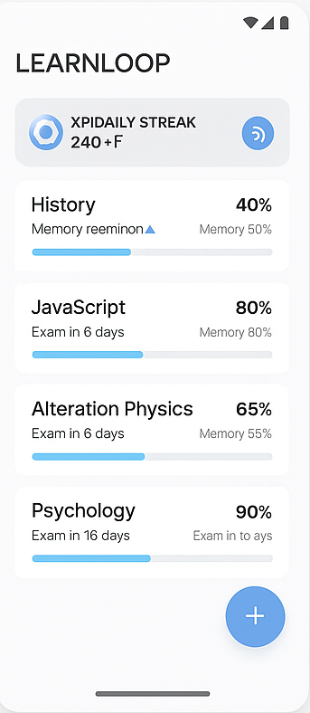
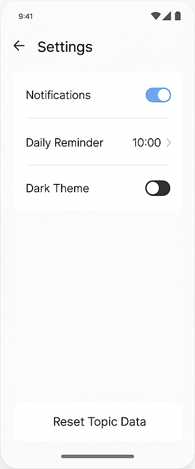
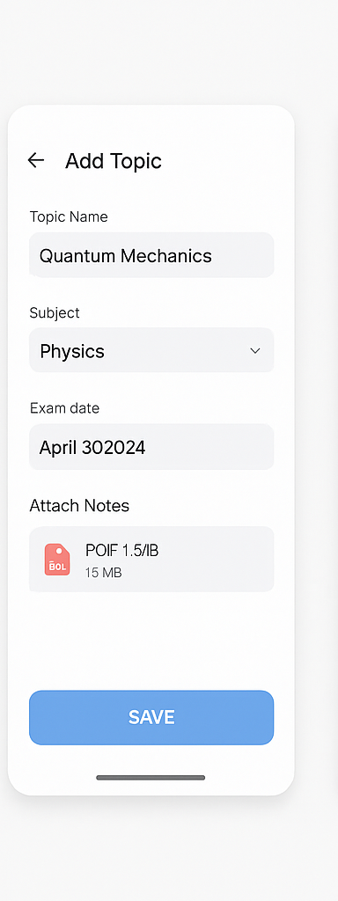

# 📚 LearnLoop – Smart Revision App

**LearnLoop** is a spaced repetition Android app designed to help students plan and retain what they study more effectively. Built in Kotlin using Android Studio, the app auto-generates revision schedules based on the user’s syllabus, memory retention, and upcoming exam dates.

---

## 🚀 Features

- 📌 **Add Topics** – Create revision topics with subject and exam date
- 📅 **Spaced Repetition Scheduler** – AI-powered scheduling for long-term memory retention
- 📤 **Attach Notes** – Upload PDFs, images, or typed notes per topic
- 🧠 **Daily Review Suggestions** – Smart reminders of what to review each day
- 🧩 **Gamification** – Earn XP, track streaks, and level up for consistency
- 🔔 **Daily Notifications** – Get notified about your study plan
- 📊 **Progress Dashboard** – Visualize your revision journey
- 🌙 **Dark Mode Support**

---

## 🛠️ Tech Stack

- **Kotlin** with Android Jetpack (Room, ViewModel, LiveData)
- **Material UI** and **Jetpack Compose**
- **Room Database** for local persistence
- **ViewBinding / DataBinding**
- **MVVM Architecture**
- GitHub for version control

---

## 📸 Preview

| Home Screen | Add Topic Dialog | Daily Review | XP Dashboard | Topic Detail |
|-------------|------------------|--------------|--------------|--------------|
|  |  |  |  |


---

## 🧪 Roadmap / TODO

- [ ] Implement spaced repetition logic
- [ ] Add XP and streak tracker
- [ ] File upload & notes preview
- [ ] Notification service
- [ ] Backup/export options
- [ ] Firebase integration (optional)

---

## 📦 Setup Instructions

```bash
git clone https://github.com/yourusername/learnloop-app.git
cd learnloop-app
# Open in Android Studio and run
